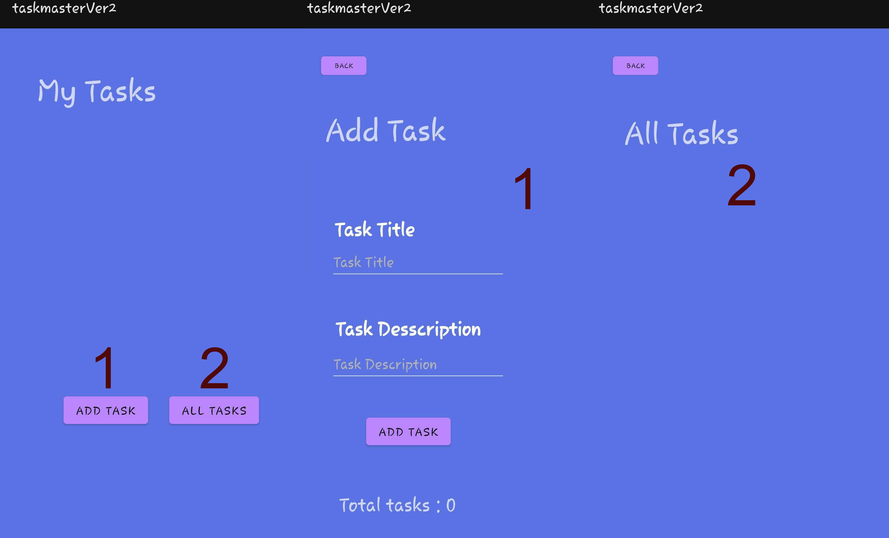
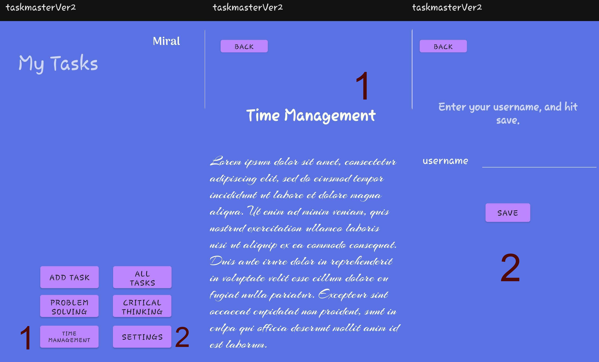
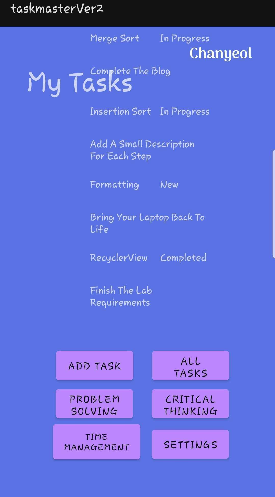
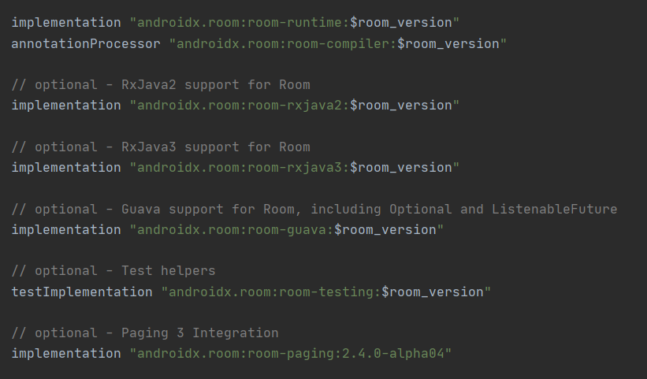
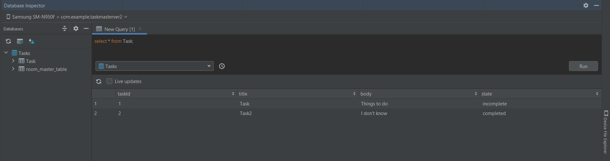
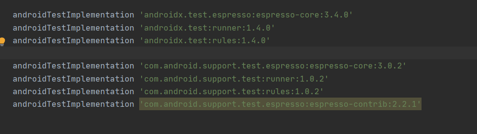
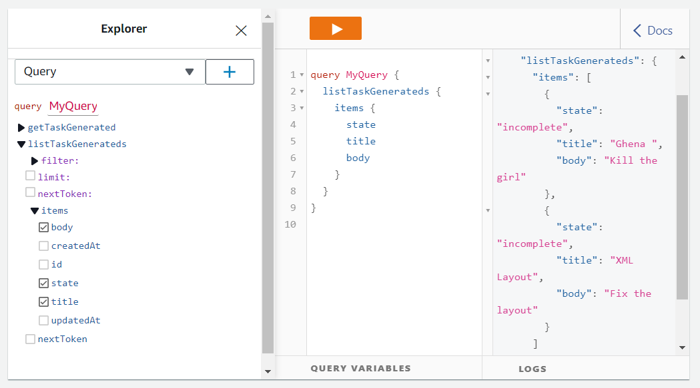
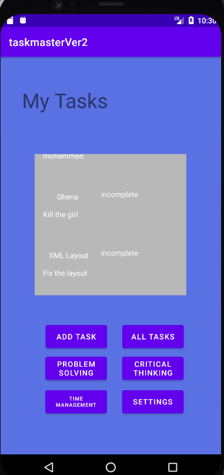

# TaskMaster

This project iss an android mboile application built with Java and XML. 

# Lab - 1 29/8/2021

AS a user, you will find three activties one iss the Home screen, the other is for adding tasks and the last is to show all of tasks. 

The following screenshotss clarifies the layout of those activities and take it as a short tour in the application. 

 

 

## How to usse the application? 

 From the home screen you can navigate to : 

  **Add Task** 

    1- To add a new task, click on the Add Task button. It will lead you to the add task activity.

    2- You can go back to the home page by clicking on the back button on top left. 

  **All Tasks**

    1- To check the tasks, click on the All Tasks button and it will lead you to the All tasks activity. 
	
	2- You can go back to the home page by clicking on the back button on top left.

 

# Lab - 2 30/8/2021

 

# Lab - 3 31/8/2021

 

 

# Lab - 4 1/9/2021

 

- This Lab is about creating a database to save the data that the user enterd in records. 

- It's a local database, which means that the user can accsess only locally.

- In order to create this database, there is a library that called Room which can be added to the dependencies as following : 

 

 

- What is the Room? 

  - "The Room persistence library acts as a layer that abstracts raw SQLite and lets you make use of robust database access while keep you close to SQLite so it doesn't get in the way when you want to access low level features of SQLite." [[Resource](https://www.techiediaries.com/android-room-tutorial/)]

 

The following Image shows the database that called Tasks, it has one entity called Task that contains three fields (Columns) : 
  
  - Id (Generated automatically from the Room itself).

  - Title 

  - Body

  - State

 

# Lab - 5 5/9/2021

This lab is about Testing the application.The Espresso Testing was used in order to deal with testing, The prevoius imapge shows the dependencies that must be added to the build.gradle file. 

The tests that were used in the code : 

 - One is for testing a static text. 

 - One for testing the clickable items in the RecyclerView.

 - Testing the input fields. 

 - Testing the displaying of the username on the Main Activity. 

  

# Lab - 6 7/9/2021

- For this lab, we replaced the database server from using the ROOM Library to the AWS Amplify. 

- The same functionality is still working on, the only difference is that saving the data is now on the cloud instead of locally.

