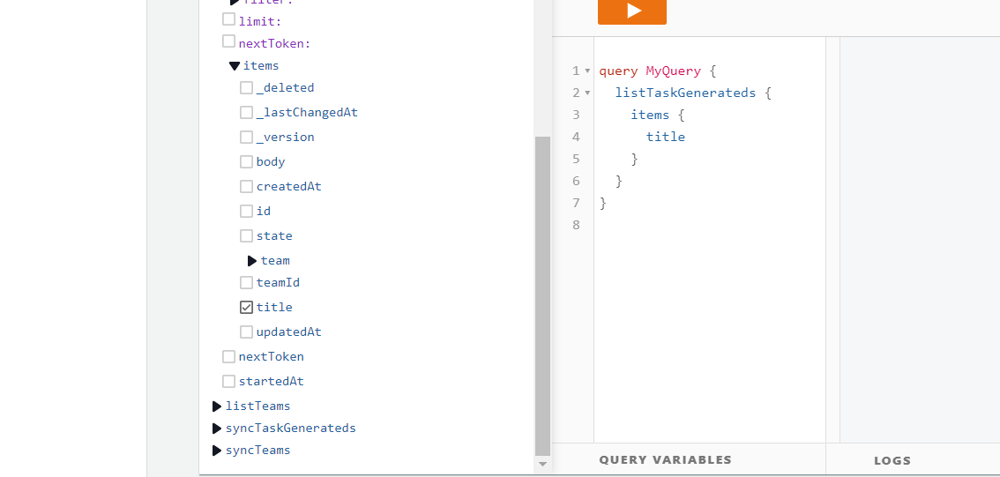
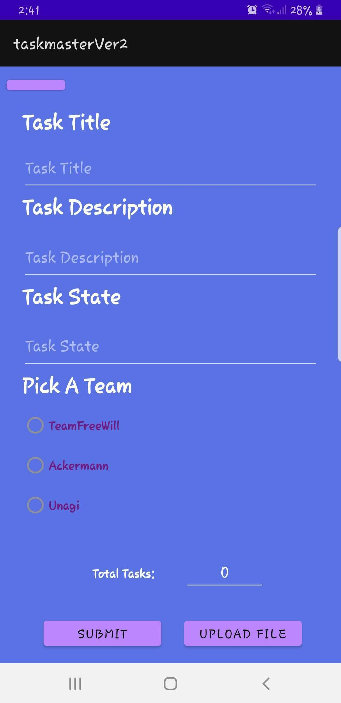
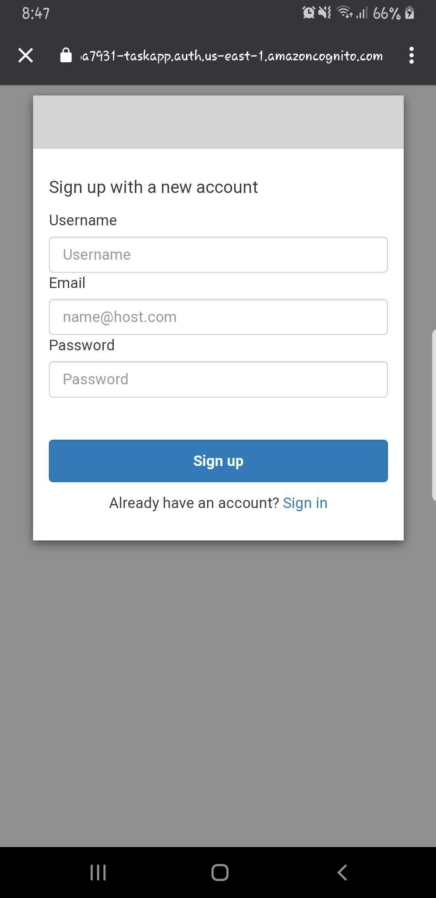
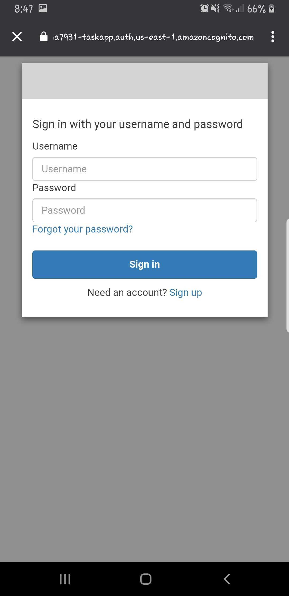
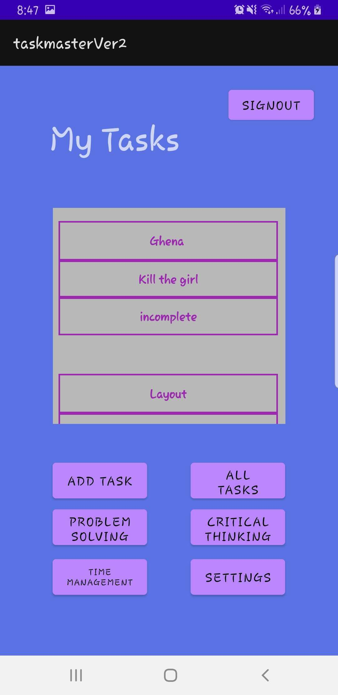
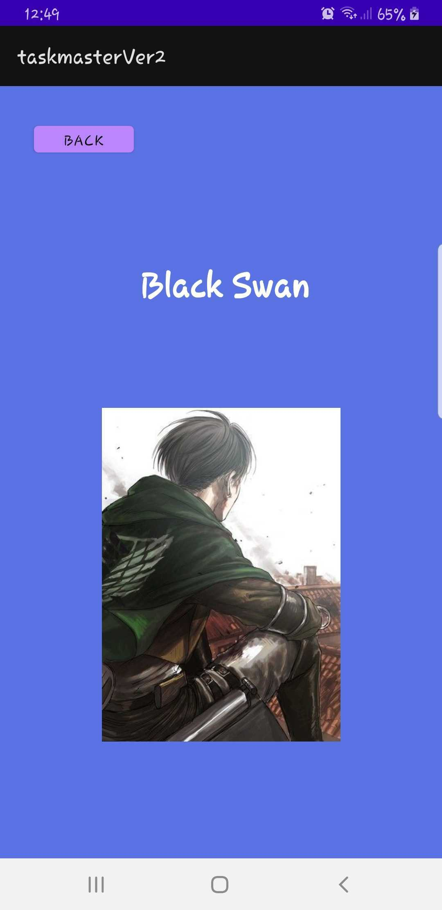
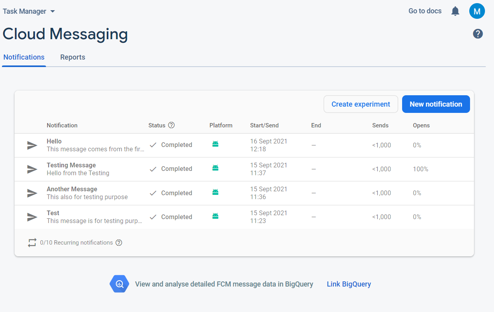
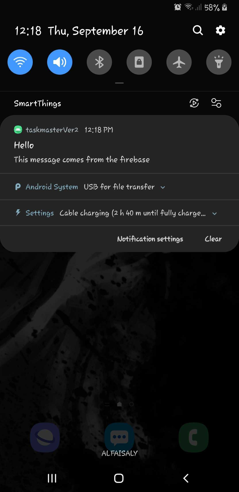

# TaskMaster

This project iss an android mboile application built with Java and XML. 

# Lab - 1 29/8/2021

AS a user, you will find three activties one iss the Home screen, the other is for adding tasks and the last is to show all of tasks. 

The following screenshotss clarifies the layout of those activities and take it as a short tour in the application. 

<br>


<br>

## How to usse the application? 

 From the home screen you can navigate to : 

  **Add Task** 

    1- To add a new task, click on the Add Task button. It will lead you to the add task activity.

    2- You can go back to the home page by clicking on the back button on top left. 

  **All Tasks**

    1- To check the tasks, click on the All Tasks button and it will lead you to the All tasks activity. 
	
	2- You can go back to the home page by clicking on the back button on top left.

<br>


# Lab - 2 30/8/2021

<br>


# Lab - 3 31/8/2021

<br>


<br>

# Lab - 4 1/9/2021

<br>

- This Lab is about creating a database to save the data that the user enterd in records. 

- It's a local database, which means that the user can accsess only locally.

- In order to create this database, there is a library that called Room which can be added to the dependencies as following : 

<br>


<br>

- What is the Room? 

  - "The Room persistence library acts as a layer that abstracts raw SQLite and lets you make use of robust database access while keep you close to SQLite so it doesn't get in the way when you want to access low level features of SQLite." [[Resource](https://www.techiediaries.com/android-room-tutorial/)]

<br>

The following Image shows the database that called Tasks, it has one entity called Task that contains three fields (Columns) : 
  
  - Id (Generated automatically from the Room itself).

  - Title 

  - Body

  - State


<br>

# Lab - 5 5/9/2021


This lab is about Testing the application.The Espresso Testing was used in order to deal with testing, The prevoius imapge shows the dependencies that must be added to the build.gradle file. 

The tests that were used in the code : 

 - One is for testing a static text. 

 - One for testing the clickable items in the RecyclerView.

 - Testing the input fields. 

 - Testing the displaying of the username on the Main Activity. 

 <br>

# Lab - 6 7/9/2021


- For this lab, we replaced the database server from using the ROOM Library to the AWS Amplify. 

- The same functionality is still working on, the only difference is that saving the data is now on the cloud instead of locally.

# Lab - Relations 

In This lab, Another entity has been created wich is **Team**, This entity should be specified each time a task will be created. 



This image shows the relation between the Team end the Task entities. 

In order to do so, the following steps has been applied : 

 1- The schema has been updated with the new entity.

 2- The modal code has been generetaed to meet the new schema. 




This image shows how it required to specify a team in order to add a new task. 

<br>
<br>


# Lab - 7 13/9/2021

Adding the authentication to the application using `amplify authentication`: 

  - In order to do that, I used the [Sign in with web UI](https://docs.amplify.aws/lib/auth/signin_web_ui/q/platform/android/) methodology which add the activity of sining in an singning up directly from AWS. 

  - The Actvity: 

  ```
  <activity
            android:name="com.amplifyframework.auth.cognito.activities.HostedUIRedirectActivity"
            android:exported="true">
            <intent-filter>
                <action android:name="android.intent.action.VIEW" />
                <category android:name="android.intent.category.DEFAULT" />
                <category android:name="android.intent.category.BROWSABLE" />
                <data android:scheme="myapp" />
            </intent-filter>
        </activity>
  ```
  







<br>
<br>

# Lab - 8 14/9/2021

Allow the user to upload an image from the device whenever he adds a new task, and display it on the page of tasks.

In order to do so, we used the AWS S3 service which provide us with a storage to hold those uploaded files in the cloud. 

Some dependecies and plugins required to accomplish the process : 

```
dependencies {
    implementation 'com.amplifyframework:aws-storage-s3:1.24.0'
    implementation 'com.amplifyframework:aws-auth-cognito:1.24.0'
}
-------------------------------------------------------------------
Amplify.addPlugin(new AWSCognitoAuthPlugin());
Amplify.addPlugin(new AWSS3StoragePlugin());
```




<br>
<br>

# Lab - 9 15/9/2021

## Amazon Simple Notification Service

- Fully managed pub/sub messaging, SMS, email, and mobile push notifications.

This lab is about getting notifications from the firebase.


**Sender :** 



**Reciever :**


